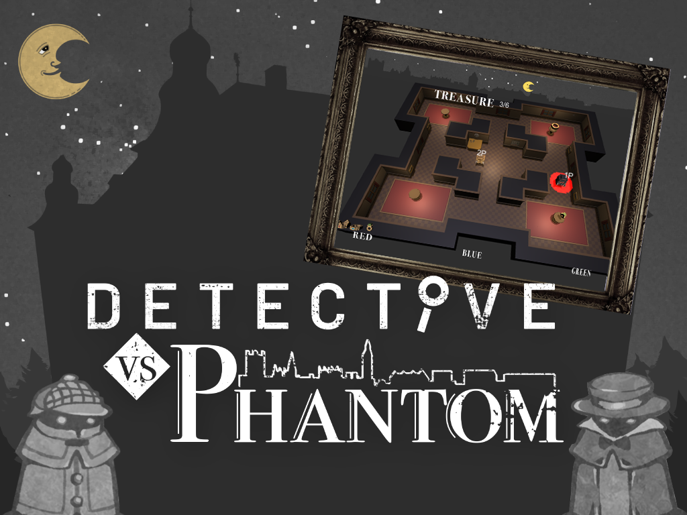

# 探偵と怪盗 - Detective vs Phantom

[探偵と怪盗](https://globalgamejam.org/2021/games/detective-vs-phantom-6)は[グローバルゲームジャム2021オンライン@瀬戸内会場](https://globalgamejam.org/2021/jam-sites/setouchi)で作成したゲームです。  

プレイヤーは探偵と怪盗になることができます。  
怪盗はお宝を奪い続けましょう。探偵は怪盗を逮捕してお宝が奪われるのを阻止しましょう。

[遊んでみる(Win版公開中)](https://github.com/kamera25/detective_vs_phantom/tags)

## 操作
  - 開始直後、あなたは探偵として正義のため生きるか、怪盗として生きるかを決めます。
  - ジョイスティックで操作します。また2〜4人のプレイヤーが必要です。
  - 探偵は怪盗を捕まえて、お宝が奪われるのを阻止してください。
  - 怪盗は盗賊から逃げつつ、お宝を奪い続けてください。
  - 時間が朝になるか、美術館のお宝が全てなくなったらゲーム終了です。朝までお宝が残っていれば、探偵の勝ちです。

## 使用しているツール

* [Unity](phaser-link) - 3Dゲームエンジン
* [MagicaVoxel](https://ephtracy.github.io) - 3Dボクセルの作成
* [Blender](https://blender.jp) - アニメーション制作
* [Photoshop](https://www.adobe.com/jp/products/photoshop.html) - 画像作成ツール

## 開発を開始するには？

1) Git経由でリポジトリをダウンロードして、ローカルに展開します。  
2) Unity 2019.4.18(LTS)f1でクローンしたプロジェクトを指定して、展開してください。

## 今年のグローバルゲームジャム
### テーマ

[2020年のテーマ: 「Lost and Found」](https://globalgamejam.org/news/theme-global-game-jam-online-2021)

今回のテーマLost and Foundを基にペラコンを開催しました。  
今回はdenimさんのアイデア「Lost and Found(失うことと得ること)から宝石などを奪う怪盗と、
その怪盗を追う探偵」をベースに、新しいゲームを作成しています。

### 追加課題

[2021年の追加課題](https://globalgamejam.org/news/ggj-online-diversifiers)

- 写真 - 身近な場所の写真を素材にしました。絵画のテクスチャで利用しています。
- A11yversary - 快適なアクセシビリティを目指しました。ジョイスティックを倒すだけで遊べます。
- デュエット - 「2種類のキャラクター」を操作して遊びます。

### ジャムサイト
スペシャルサンクス : [GGJ瀬戸内会場の皆さん](https://globalgamejam.org/2021/jam-sites/setouchi) 

### チーム
- denim - Project Leader / Designer / Modeler 
- Dr.ツキツキキ - Programmer
- kerokerop0607 - Programmer
- watanabe - Effect engineer
- kumasho - UI Designer
- Yasu - Programmer
- kamera25 - 3D Modeler

### お借りした素材
- [効果音LAB様](https://soundeffect-lab.info)
- [OtoLogic様](https://otologic.jp/free/license.html) - CC-BY-4.0
- [MusMus様](https://musmus.main.jp)
- [音ジャム様](https://dova-s.jp)

※上記ファイルは再配布禁止のため、このリポジトリには同封しておりません。各々のページにてSE/BGMの入手をお願いいたします。

#### ライセンス: [ Attribution-NonCommercial-ShareAlike 4.0 International (CC BY-NC-SA 4.0)][license-link]
#### [GGJの法的とポリシー情報][ggj-legal-link]

   [license-link]: <https://creativecommons.org/licenses/by-nc-sa/4.0/>
   [ggj-legal-link]: <https://globalgamejam.org/legal-policies>
